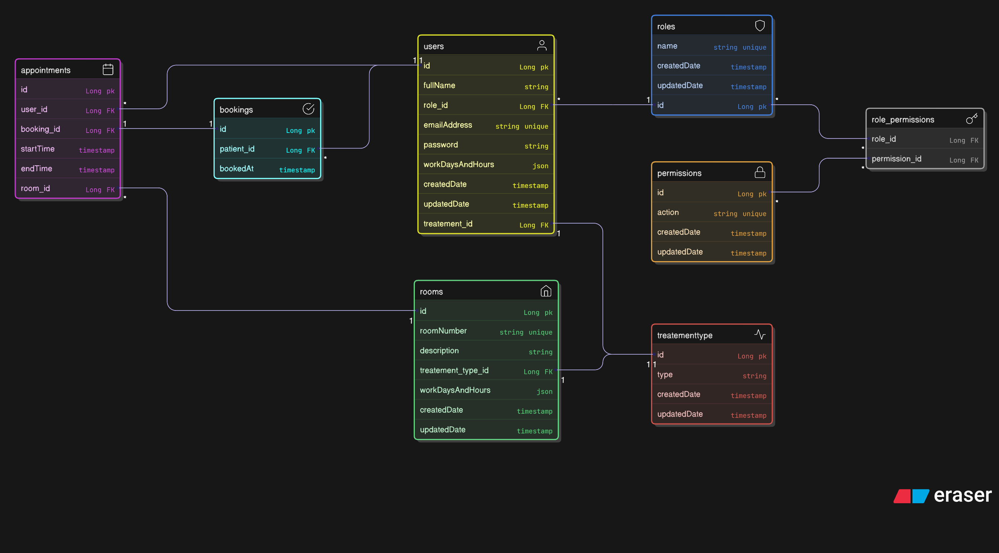

# Project2
## Hospital Management System

A backend RESTFUL API designed to manage hospital operations efficiently.The system handles user authentication, role-based access control, and core hospital workflows such as managing doctors, patients, appointments, bookings, rooms,etc...

It supports multiple user roles **Admin**, **Doctor**, and **Patient** with secure access and clear separation of responsibilities.

## Tools & Technologies

- **Java 17**
- **Spring Boot (MVC, Security, Data JPA)**
- **JWT (JSON Web Tokens)** for authentication and authorization
- **PostgreSQL** with **Hibernate (JPA)**
- **Maven** for build and dependency management
- **Lombok** to reduce boilerplate code
- **Jackson** for JSON processing
- **Spring Boot Mail** for email services

## General Approach

The project was developed using a clean, layered architecture following the **Controller → Service → Repository → Entity** pattern. This structure ensures clear separation of concerns, improves maintainability, and makes the codebase easier to extend and test. The domain models were designed first to reflect realistic hospital workflows, after which the core authentication and authorization mechanisms were implemented before building the remaining services and controllers incrementally.

Security was a primary focus of the system. A custom **JWT-based authentication** mechanism was implemented using Spring Security, including token generation, validation, and a request filter to secure protected endpoints. Role-based access control (RBAC) was designed dynamically, with roles and permissions stored in the database and enforced using method-level security (`@PreAuthorize`). The overall approach emphasized clean code, strong security practices, and adherence to Spring Boot best practices while building hospital management backend.

## Challenges & Limitations

The main challenges were implementing a dynamic role-based access control (RBAC) system, designing role–permission relationships, and integrating email functionality. These features were new to some team members, which required additional learning to implement correctly.

## User Stories:
#### Admin
- As an Admin, I want to view, create, update, and delete non-patient accounts(users)
- As an Admin, I want to view, create, update, and delete rooms
- As an Admin, I want to view, create, update, and delete treatment types
- As an Admin, I want to link, unlink users with treatment types
- As an Admin, I want to link, unlink rooms with treatment types
#### Doctor
- As a Doctor, I want to view booked appointments
- As a Doctor, I want to cancel appointments
#### Patient
- As a Patient, I want to view available appointments
- As a Patient, I want to book an appointment
- As a Patient, I want to view booked appointments
- As a Patient, I want to cancel booked appointment
- As a Patient, I want to replace booked appointment
#### Logged in user
- As a logged in user, I want to view my profile
- As a logged in user, I want to reset my password

# API Endpoints

| Method | Endpoint | Description | Access Role |
|--------|----------|-------------|-------------|
| POST | /api/auth/register | Register a new user | Public |
| POST | /api/auth/login | Authenticate user and return token | Public |
| POST | /api/auth/logout | Logout current user | Authenticated |
| GET | /api/users/me | Get current user profile | Authenticated |
| PUT | /api/users/me | Update current user profile | Authenticated |
| GET | /api/users | Get all users | Admin |
| GET | /api/users/{id} | Get user by ID | Admin |
| DELETE | /api/users/{id} | Delete user | Admin |
| GET | /api/doctors | Get all doctors | Authenticated |
| GET | /api/doctors/{id} | Get doctor profile | Authenticated |
| PUT | /api/doctors/{id}/availability | Set doctor working days and hours | Doctor |
| GET | /api/doctors/{id}/appointments | Get doctor appointments | Doctor |
| GET | /api/patients/{id}/bookings | Get patient bookings | Patient |
| POST | /api/rooms | Create room | Admin |
| GET | /api/rooms | Get all rooms | Authenticated |
| GET | /api/rooms/{id} | Get room details | Authenticated |
| PUT | /api/rooms/{id} | Update room | Admin |
| DELETE | /api/rooms/{id} | Delete room | Admin |
| POST | /api/treatments | Create treatment type | Admin |
| GET | /api/treatments | Get all treatment types | Authenticated |
| PUT | /api/treatments/{id} | Update treatment type | Admin |
| DELETE | /api/treatments/{id} | Delete treatment type | Admin |
| POST | /api/appointments | Create appointment slot | Admin |
| GET | /api/appointments | Get all appointments | Authenticated |
| GET | /api/appointments/available | Get available appointments | Patient |
| GET | /api/appointments/{id} | Get appointment details | Authenticated |
| DELETE | /api/appointments/{id} | Delete appointment | Admin |
| POST | /api/bookings | Book an appointment | Patient |
| GET | /api/bookings/{id} | Get booking details | Patient |
| DELETE | /api/bookings/{id} | Cancel booking | Patient |
| POST | /api/roles | Create role | Admin |
| GET | /api/roles | Get all roles | Admin |
| POST | /api/permissions | Create permission | Admin |
| GET | /api/permissions | Get all permissions | Admin |
| PUT | /api/roles/{id}/permissions | Assign permissions to role | Admin |

# Our ERD

## trello link
https://trello.com/invite/b/695d2d0130962712434d4c6f/ATTIce8d7818f85a379fc47b04c978d056e56AE3CFDE/my-trello-board

## Postman Collection

A Postman collection is included for testing all API endpoints. You can import it into Postman to quickly explore the API.

- **File location:** `Project2/Hospital.postman_collection.json`
- **Environment variable:** The collection uses a Postman environment variable `{{baseUrl}}` to define the API base URL (`http://localhost:8080`). Make sure to set `{{baseUrl}}` in Postman before sending requests.
- **To use:**
    1. Open Postman → Click `Import`
    2. Select the JSON file above
    3. Set `BaseUrl` in the environment to your API URL
    4. The collection with all endpoints will be loaded and ready to test

> Ensure your environment variables for the application (email) are configured before testing the endpoints.
